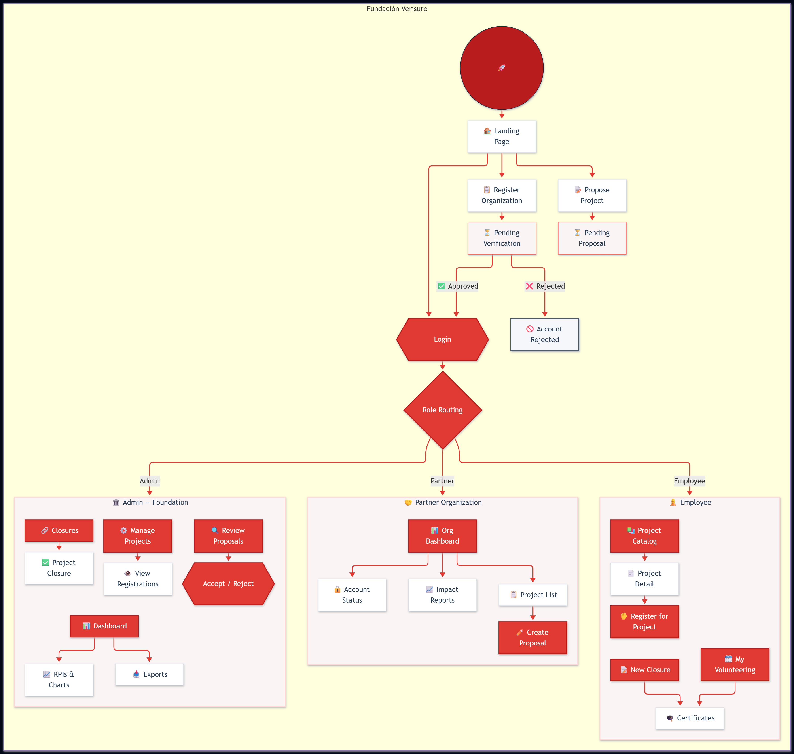

# Frontend Verisure

React application for managing Fundación Verisure's volunteer program: activity catalog, registrations, proposals, closures, partner organizations, and impact dashboard.

## Requirements

- Node.js 20 or later.
- npm 10 or later.
- [Backend](../backend) running when testing full flows.
- Modern browser: Chrome, Firefox, Edge, or Safari.

## Dependencies & Tools

| Category | Package | Usage |
| --- | --- | --- |
| Dependencies |  | UI and rendering. |
| |  | Routing, protected routes, and role-based access. |
| |  | HTTP client with interceptors. |
| |  | Iconography. |
| |  | Global error boundary. |
| DevDependencies |  | Bundler and dev server. |
| |  | Test runner. |
| |  | Component tests and coverage reports. |
| |  | Sass stylesheet compilation. |
| Tools |  | Code editor. |
| Languages |  | Frontend language. |
| |  | Stylesheet language. |

## Installation and first run

```bash
git clone <repository-url>
cd frontend
npm ci
cp .env.example .env.local
npm run dev
```

The application is available at [http://localhost:5173](http://localhost:5173). `npm ci` installs the exact versions from `package-lock.json` and is the recommended command for a clean or CI environment.

## Commands

| Command | Description |
| --- | --- |
| `npm run dev` | Starts Vite in development mode. |
| `npm run build` | Generates the optimized bundle in `dist/`. |
| `npm test` | Opens Vitest in interactive mode. |
| `npm run test:run` | Runs all tests once. |
| `npm run test:coverage` | Runs tests and generates a coverage report. |

## Architecture

```text
src/
├── api/          # Axios client, errors, and API endpoints per domain
├── assets/       # Images and icons
├── components/
│   ├── ErrorBoundary/  # Global error boundary
│   ├── layout/   # AppLayout, PublicLayout, Topbar, Sidebar, and footer
│   └── ui/       # Shared, accessible UI components
├── constants/    # Shared values, such as action lines
├── features/     # Screens and logic grouped by feature
├── hooks/        # Cross-cutting hooks
├── routes/       # Router, protected routes, and role-based authorization
├── styles/       # Sass 7-1: abstracts, base, components, layout, and pages
└── test/         # Fixtures, mocks, and test-only utilities
```

HTTP calls live in `src/api`; a screen should never call Axios directly. Feature-specific logic stays within its `feature` folder, and reusable patterns go into `components/ui`.

### Feature modules (`src/features`)

| Module | Responsibility |
| --- | --- |
| `activities` | Catalog, listing, detail, create/edit and cancellation of activities; partner review actions. |
| `auth` | Login, session context, and authentication hook. |
| `dashboard` | KPIs, charts, rankings, exports, and impact dashboard filters. |
| `favorites` | Favorite activities context for the catalog. |
| `landing` | Public home page and impact counters. |
| `not-found` | 404 page. |
| `orgs` | Partner registration, dashboard, proposals, and impact; account status. |
| `proposals` | Form, detail, inbox, acceptance, and confirmation of proposals. |
| `registrations` | Registrations: catalog, personal volunteering, management table, cancellation, and decisions. |
| `reports` | Closures (individual and global), certificates, and closure forms. |

## Routes, authentication, and roles

`AuthContext` stores `accessToken` and `user` in `localStorage`. The Axios interceptor adds `Authorization: Bearer <token>`. On a `401`, the session is cleared and the user is redirected to `/login`. `ProtectedRoute` requires a session and `RoleRoute` restricts each area.

| Area | Main routes | Role |
| --- | --- | --- |
| Public | `/`, `/login`, `/new-proposal` or `/proposal`, `/register-organization`, `/account-status` | No session |
| Foundation | `/dashboard`, `/proposals`, `/activities/:id`, `/activities/:id/registrations`, `/activities/new`, `/activities/:id/edit`, `/admin/activities`, `/admin/activities/pending-closure`, `/admin/activities/:id/closure`, `/admin/account-status` | `ADMIN` |
| Employee | `/activities`, `/activities/:id`, `/my-volunteering`, `/my-activities`, `/closures/new`, `/closures/:id`, `/closures/:id/certificate` | `EMPLOYEE` |
| Partner | `/org/dashboard`, `/org/activities`, `/org/activities/new`, `/org/proposals`, `/org/proposals/new`, `/org/reports` | `PARTNER` |

Some routes are shared: `/closures/:closureId` and `/activities/:activityId` are available to both `ADMIN` and `EMPLOYEE`. In development, `/ui-kit` is also available for the component showcase, and there are compatibility redirects: `/explore` → `/activities`, `/inscriptions` → `/activities/6/registrations` and `/closes` → `/admin/activities/pending-closure`.

Partner accounts may be in `PENDING_VERIFICATION`, `PENDING_APPROVAL`, `ACTIVE`, or `REJECTED` status. A `PARTNER` session that is not active is kept to display the account status; it is not treated as an anonymous session.

## Visual and accessibility checks

Before delivering a screen, test it with a keyboard and verify visible focus, labels, error messages, loading states, and empty states. Reference widths:

- Desktop: 1280 px and 1440 px.
- Responsive: 390 px.

There should be no accidental horizontal scroll; touch targets must be at least 44 × 44 px and text must be readable without zoom.

## User Flow & Mockups



The design reference is in [Figma](https://www.figma.com/design/D3nU4lVWHOTVRtTNeMyjol/Fundacion-Verisure-Voluntariado?node-id=0-1&p=f).

## Authors

| Name | GitHub | Role |
| --- | --- | --- |
| Elena Almansa | [@elenaalmansacampos](https://github.com/elenaalmansacampos) | Frontend |
| Fabiana Leonardo | [@fabileoruf](https://github.com/fabileoruf) | Frontend |
| Ivanna Caraccio | [@IvannaRCA](https://github.com/IvannaRCA) | Frontend |
| Andrea Tapia | [@atapiamallea](https://github.com/atapiamallea) | Backend |
| Chiara Di Maio | [@chdimaio](https://github.com/chdimaio) | Backend |
| Rosa Vaillant | [@rosana50factoria](https://github.com/rosana50factoria) | Backend |
